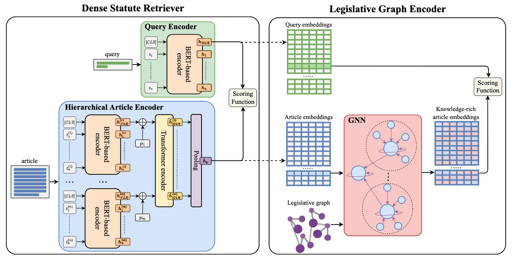

[](https://opensource.org/licenses/MIT)
[](https://www.python.org/downloads/)
[](https://arxiv.org/abs/2301.12847)
[](https://huggingface.co/datasets/maastrichtlawtech/bsard)

# Graph-augmented Dense Statute Retriever

This repository contains the code for reproducing the experimental results presented in the EACL 2023 paper ["Finding the Law: Enhancing Statutory Article Retrieval via Graph Neural Networks"](https://aclanthology.org/2023.eacl-main.203/) by [Antoine Louis](https:/antoinelouis.co/work/), [Gijs van Dijck](https://www.maastrichtuniversity.nl/gijs.vandijck) and [Jerry Spanakis](https://dke.maastrichtuniversity.nl/jerry.spanakis/).

<p align="center"></p>

Statutory article retrieval (SAR), the task of retrieving statute law articles relevant to a legal question, is a promising application of legal text processing. In particular, high-quality SAR systems can improve the work efficiency of legal professionals and provide basic legal assistance to citizens in need at no cost. Unlike traditional ad-hoc information retrieval, where each document is considered a complete source of information, SAR deals with texts whose full sense depends on complementary information from the topological organization of statute law. While existing works ignore these domain-specific dependencies, we propose a novel graph-augmented dense statute retriever (G-DSR) model that incorporates the structure of legislation via a graph neural network to improve dense retrieval performance. Experimental results show that our approach outperforms strong retrieval baselines on a real-world expert-annotated SAR dataset.

## Documentation

Detailed documentation on the dataset and how to reproduce the main experimental results can be found [here](docs/README.md).

## Citation

For attribution in academic contexts, please cite this work as:

```latex
@inproceedings{louis2023finding,
  title = {Finding the Law: Enhancing Statutory Article Retrieval via Graph Neural Networks},
  author = {Louis, Antoine and van Dijck, Gijs and Spanakis, Gerasimos},
  booktitle = {Proceedings of the 17th Conference of the European Chapter of the Association for Computational Linguistics},
  month = may,
  year = {2023},
  address = {Dubrovnik, Croatia},
  publisher = {Association for Computational Linguistics},
  url = {https://aclanthology.org/2023.eacl-main.203/},
  pages = {2753–2768},
}
```

## License

This repository is MIT-licensed.
